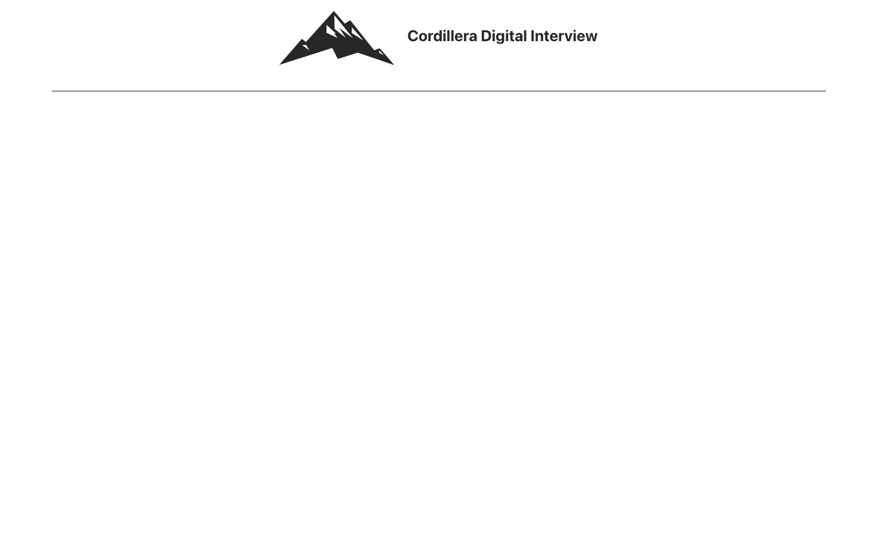

# Cordillera Digital FE Interview
This is the base project for the Cordillera Digital FE Interview. You need to have this repository running before the interview to avoid missconfigurations and losing time during the interview.
Once you are in the interview we are going to give you an excercise and you are going to use this repository to code the excercise.
The exercise is going to be simple. It is also going to be related to your daily tasks based on your role and expertise level.

## How to run this project?

### Install node v20.0.0
You can install a standalone version or use a the node version manager (nvm). There is a .nvmrc file so you can just run `nvm use` if you already have installed nvm.

### Install the node dependencies
`npm install`

### Run the development server
`npm run dev`

You should be able to access the server in localhost:5173 and see this page.

Now you are ready for the interview! Good luck! 💪💪💪
